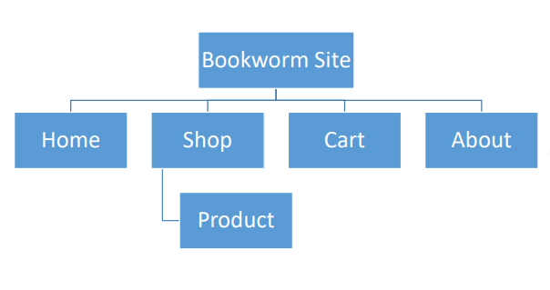

<br />
<div align="center">
  <a href="https://github.com/vothanhloc20/bookworm-app">
    
  </a>

  <h3 align="center">BookWorm App</h3>

  <p align="center">
    A website for a book store that is called BookWorm
  </p>
</div>

<br />

<details>
  <summary>Table of Contents</summary>
  <ol>
    <li>
      <a href="#about-the-app">About The app</a>
      <ul>
        <li><a href="#built-with">Built With</a></li>
      </ul>
    </li>
    <li>
      <a href="#getting-started">Getting Started</a>
      <ul>
        <li><a href="#technical-requirements">Technical Requirements</a></li>
        <li><a href="#prerequisites">Prerequisites</a></li>
        <li><a href="#installation">Installation</a></li>
      </ul>
    </li>
    <li><a href="#site-map">Site Map</a></li>
    <li><a href="#license">License</a></li>
    <li><a href="#contact">Contact</a></li>
  </ol>
</details>

<br />

## About The App

![BookWorm Screen Shot][app-screenshot]

BookWorm App is a full-stack sample web application that creates a storefront (and backend) for customers to shop for books. Ứng dụng được xây dựng bằng cơ chế Single Page App (SPA). You can filter, sort, look at recommendations and best sellers, manage your cart, checkout, and more.

<br />

### Built With

The web app uses the major frameworks/libraries below.

-   [![React][react.js]][react.js-url]
-   [![Laravel][laravel.com-shields]][laravel.com-url]
-   [![Bootstrap][bootstrap.com-shields]][bootstrap.com-url]
-   [![PostgreSQL][postgresql.org-shields]][postgresql.org-url]

<br />

## Getting Started

### Technical Requirements

-   Using the Laravel v9.0 framework to build a
    backend system that provides API endpoints.
-   Using the ReactJs v17.0 library to build a frontend system as a single page application (SPA) for the site.
-   Use <a href="https://laravel.com/docs/9.x/sanctum#introduction" style="color: white"><u>Laravel Sanctum</u></a> package - #SPA Authentication
-   Using PostgreSQL for database.
-   Using the Boostrap v4.0 framework to build
    responsive for the site
-   Besides using those technical requirements as
    mandatory, you might have select others.

### Prerequisites

```sh
composer install
```

### Installation

1. Clone the repository:
    ```sh
    git clone https://github.com/vothanhloc20/bookworm-app
    ```
2. Configure .env:

    ```env
     DB_CONNECTION=YOUR_DATABASE_CONNECTION
     DB_HOST=YOUR_DATABASE_HOST
     DB_PORT=YOUR_DATABASE_PORT

     DB_DATABASE=YOUR_DATABASE_NAME
     DB_USERNAME=YOUR_DATABASE_USERNAME
     DB_PASSWORD=YOUR_DATABASE_PASSWORD
    ```

3. Generate app key by running command:

    ```sh
    php artisan key:generate
    ```

4. Make sure Apache/Nginx & PostgreSQL are running
   on your local machine
5. Migrate & seed database by running command:
    ```sh
    php artisan migrate:fresh --seed
    ```
6. Running app:
    ```sh
    php artisan serve
    ```

<br />

## Site Map

<p align="center">
  
</p>

<!-- LICENSE -->

## License

Distributed under the MIT License. See `LICENSE.txt` for more information.

## Contact

Thanh Loc Vo - [@LinkedIn](https://www.linkedin.com/in/vo-thanh-loc/) - vothanhloc20@gmail.com

Project Link: [https://github.com/vothanhloc20/bookworm-app](https://github.com/vothanhloc20/bookworm-app)

[app-screenshot]: resources/assets/screenshot_shop.png
[laravel.com-shields]: https://img.shields.io/badge/Laravel-FF2D20?style=for-the-badge&logo=laravel&logoColor=white
[laravel.com-url]: https://laravel.com
[react.js]: https://img.shields.io/badge/React-20232A?style=for-the-badge&logo=react&logoColor=61DAFB
[react.js-url]: https://reactjs.org/
[bootstrap.com-shields]: https://img.shields.io/badge/Bootstrap-563D7C?style=for-the-badge&logo=bootstrap&logoColor=white
[bootstrap.com-url]: https://getbootstrap.com
[postgresql.org-shields]: https://img.shields.io/badge/PostgreSQL-316192?style=for-the-badge&logo=postgresql&logoColor=white
[postgresql.org-url]: https://www.postgresql.org/
